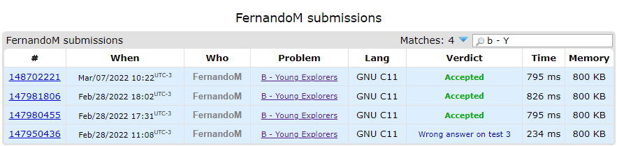

# ExerciciosCodeForces

**Número da Lista**: 3<br>
**Conteúdo da Disciplina**: Greed<br>

## Alunos
|Matrícula | Aluno |
| -- | -- |
| 17/0080102  |  Lucas Gomes Lopes |
| 19/0106565  |  Fernando Miranda Calil |

## Sobre 
Este projeto visa solucionar 3 problemas de algoritomos ambiciosos do juiz online CodeForces.
Os problemas são:

* [Movie Critics](https://codeforces.com/problemset/problem/250/C)

* [BerSU Ball](https://codeforces.com/problemset/problem/489/B)

* [Young Explorers](https://codeforces.com/problemset/problem/1355/B)


## Screenshots

### Accepted do problema Movie Critics


### Accepted do problema BerSU Ball


### Accepted do problema Young Explorers


## Instalação 
**Linguagem**: Python e C<br>
**Framework**: Não Há<br>

Clone repositório:

```sh 
git clone git@github.com:projeto-de-algoritmos/Greed_ExerciciosCodeForces.git
```

## Uso 
Para executar as questões em Python:

```sh 
python3 250C.py
```
```sh 
python3 489B.py
```
Para executar a questão em C:

```sh 
make 1355B

./1355B
```

## Outros 
Quaisquer outras informações sobre seu projeto podem ser descritas abaixo.


